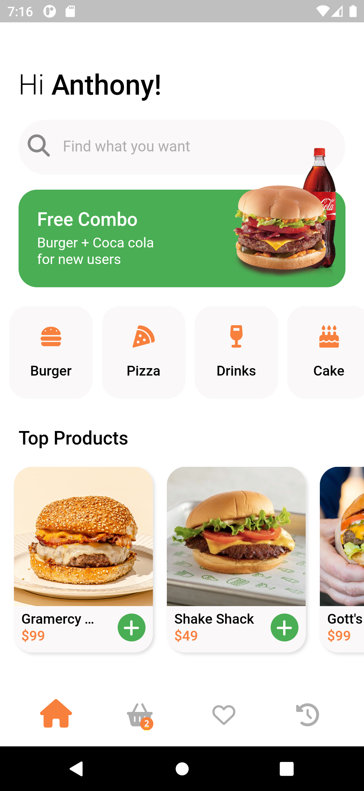
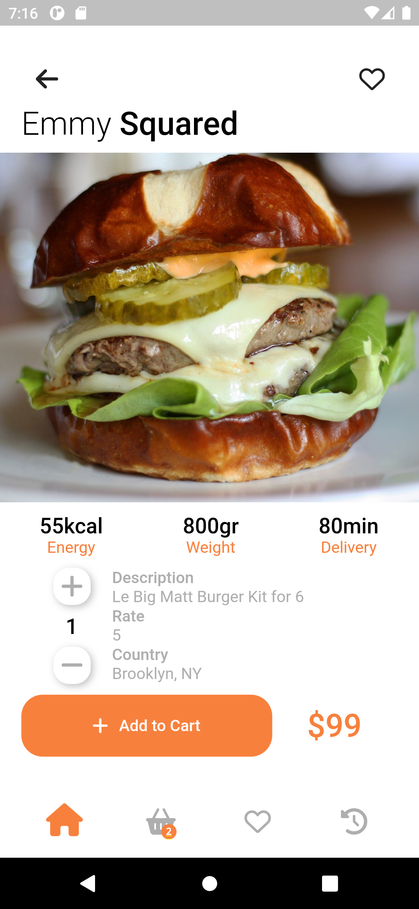
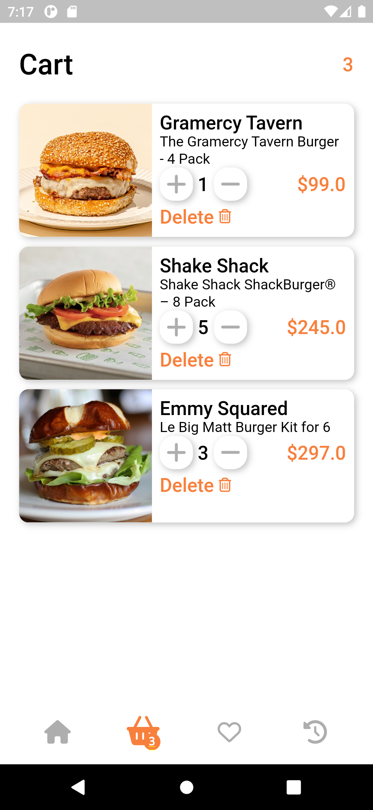

# Ntisa Burgers

An mobile developer technical assesment for build


## Recording


## Screenshots





## Resources
- [x] [Ui Design](https://dribbble.com/shots/14218141-Food-App-%20Concept/attachments/5858715?mode=media)
- [x] [API](https://ig-food-menus.herokuapp.com/burgers)

## Features
- Animated Navigation 
- Add to cart form home page
- Add to favorites and a favorite indicator on favorite burgers!
- Overall app managment using flutter provider

## How to use
1. Download the project or clone it to your local git repository
2. Create a `.env` to add the base url for the api
3. In the `.env` file, add the variable
```
BASE_URL=https://link-to-api-url
```
4. run `flutter pub get` in your terminal to get all required dependencies
5. build or run the app.